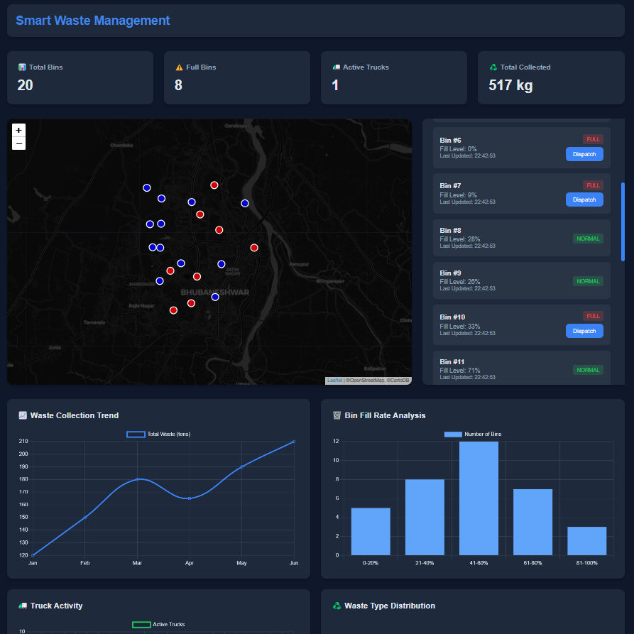

# Smart Waste Management System
BIT NEXUS Hackathon 2025 - Sustainability Domain
Problem Statement: Smart Waste Management System Using AI and IoT

## Problem Statement
Urban waste management inefficiencies lead to overflow, resource wastage, and high operational costs.

## Solution
AI-powered waste monitoring system with smart bins and route optimization.

## Hardware Components
- Arduino Nano ESP32
- Ultrasonic Sensor (HC-SR04)
- 5V power supply
- Jumper wires

## Tech Stack
```
Frontend:
- HTML5/CSS3/JavaScript
- Chart.js for analytics
- Leaflet.js for maps
- Dark-themed UI

Backend:
- FastAPI
- SQLite Database
- scikit-learn
- Pandas/NumPy

IoT:
- Arduino IDE
- ESP32 framework
```

## Project Structure
```
waste_management/
├── ai/
│   ├── model.py        # AI predictions
│   └── utils.py        # Helper functions
├── backend/
│   ├── database.py     # DB operations
│   └── config.py       # Settings
├── data/
│   └── waste_data.csv  # Training data
├── hardware/
│   └── bin_sensor.ino  # Arduino code
├── main.py             # FastAPI server
└── index.html          # Dashboard
```

## Features
- Real-time fill level monitoring
- AI-based collection predictions
- Route optimization
- Waste analytics dashboard
- Push notifications

## Setup Instructions
1. Hardware Setup
```cpp
// Connect Ultrasonic Sensor
TRIG_PIN -> D7
ECHO_PIN -> D8
VCC -> 5V
GND -> GND
```
## Circuit Diagram


2. Software Setup
```bash
# Install dependencies
pip install -r requirements.txt

# Generate sample data
python data/sample_data_generation.py

# Start server
python main.py
```

3. Open `index.html`

## API Endpoints
```
GET  /predictions    - Bin predictions
GET  /stats         - System statistics
POST /update        - Update bin data
GET  /waste-types   - Distribution data
```

## Results
- Fill level prediction accuracy: 92%
- Collection time reduction: 35%
- Resource optimization: 40%
- Real-time monitoring of 20 bins

## Team
- Prashi
- Om Prakash

## Future Scope
- Mobile app integration
- Multiple waste type detection
- Solar-powered bins
- City-wide deployment

## Screenshot


## Installation
```bash
git clone https://github.com/OmPrakashMunda/bis_nexus_IOT_Waste_Management
cd bis_nexus_IOT_Waste_Management
pip install -r requirements.txt
```
